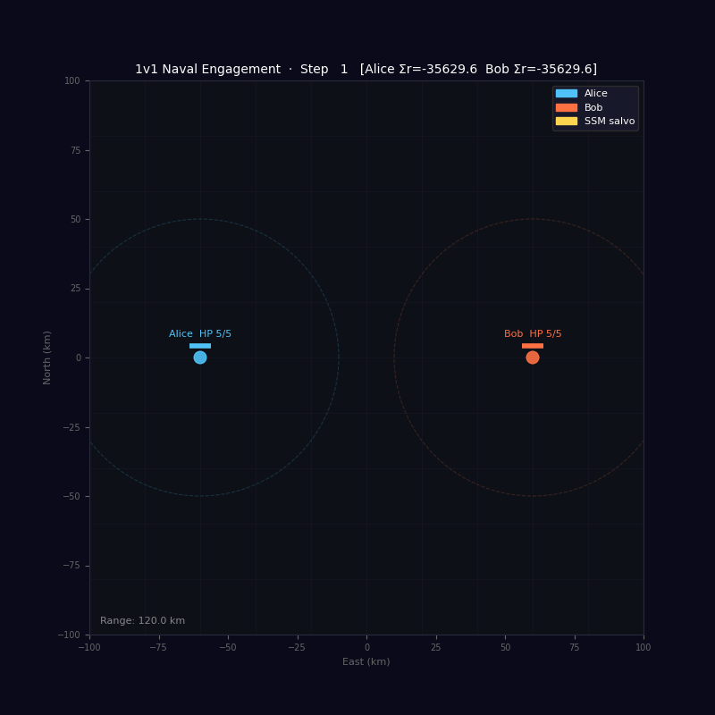
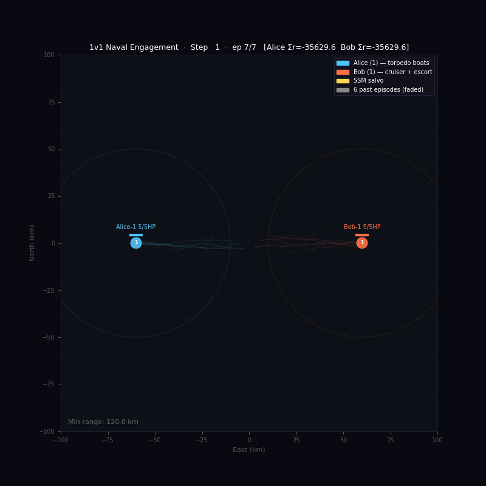
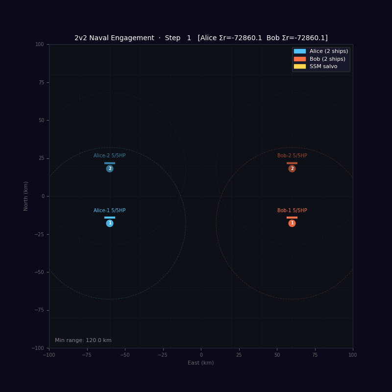
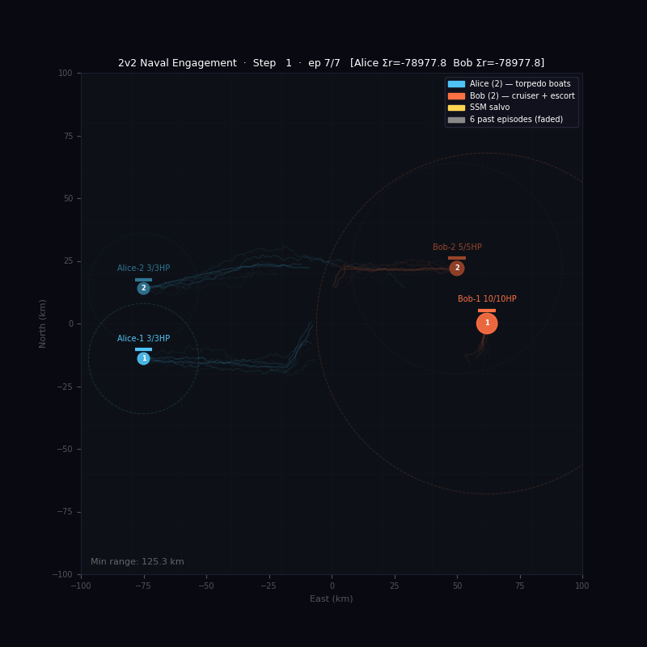
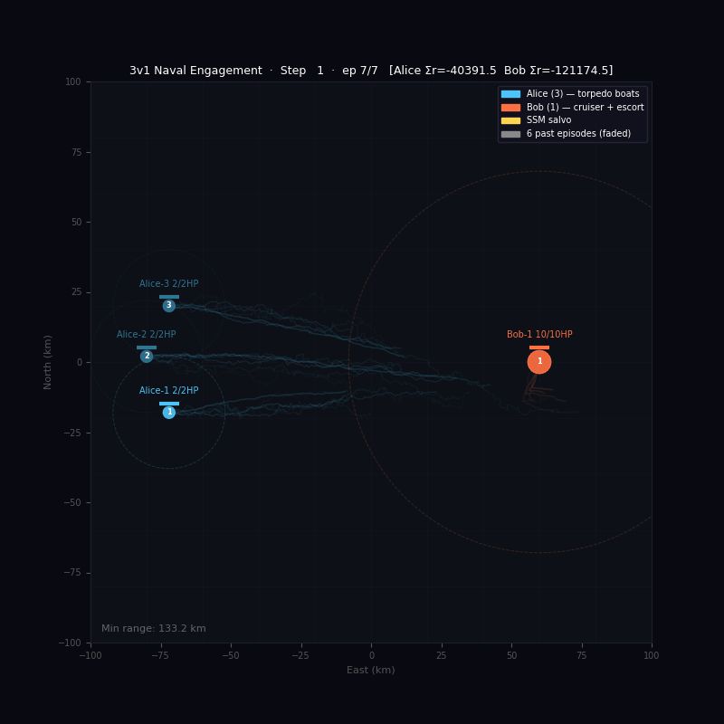
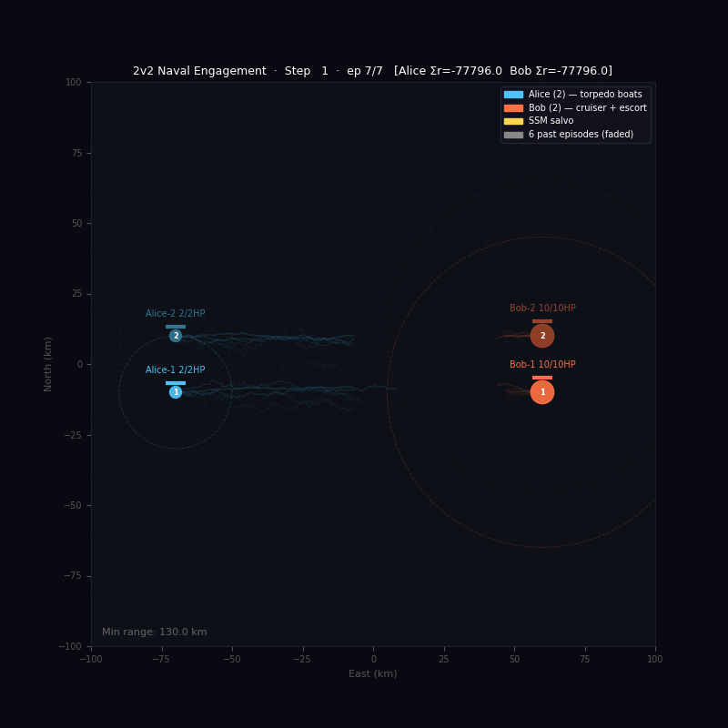
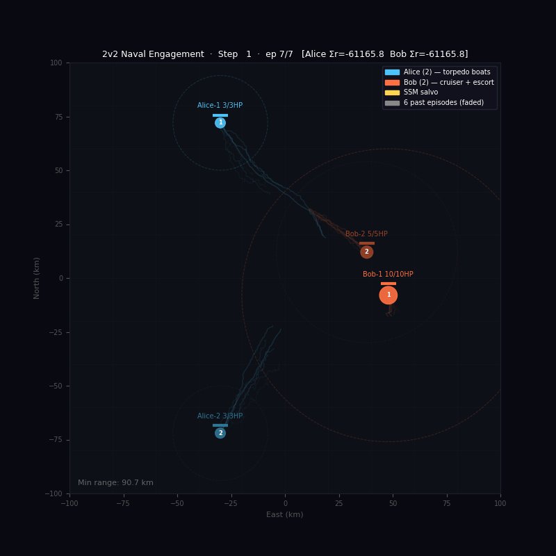

# Adversarial Reinforcement Learning in Naval Warfare

*MSc Thesis · University of Copenhagen, Faculty of Science · 2025*  
*In collaboration with TERMA A/S*


[](https://github.com/MBach0707/adversarial-reinforcement-learning-naval-warfare/actions)

---

## Overview

This project investigates whether adversarial reinforcement learning can surface **emergent naval tactics** — manoeuvres that human commanders might not discover within the constraints of real-world exercise time and risk.

The central analogy: chess engines transformed professional chess by revealing tactics beyond human calculation horizons. Could a similar approach give commanding officers an edge in real anti-surface warfare?

Two independent TD3 agents — **Alice** and **Bob** — command opposing fleets on a continuous 200×200 km battlespace. They learn simultaneously, each adapting to the other's evolving strategy, producing an adversarial arms race of tactical discovery.

*The author served as a Lieutenant Commander and Senior Navigation Officer aboard HDMS ABSALON — the same class of frigate modelled in the simulation. All physics parameters and scenario designs are grounded in operational experience.*

---

## Demo

All animations were generated from trained agent checkpoints. **Engagement** views show missile fire arcs and hit markers. **Ghost** views show trajectory trails across the full episode.

### 1v1 — Simple Attraction

| Engagement | Ghost trails |
|:---:|:---:|
|  |  |

Both ships rewarded purely for closing distance. Agents learn a direct approach within ~500 episodes. The baseline scenario used to validate TD3 convergence.

---

### 2v2 — Symmetric Engagement

| Engagement | Ghost trails |
|:---:|:---:|
|  |  |

Two-ship fleets trained adversarially. Formation cohesion (Lennard-Jones formation reward) causes Alice's ships to manoeuvre as a pair rather than independently.

---

### 3v3 — Fleet Engagement


Three ships per side. Ghost trails illustrate how fleet-level structure emerges: ships spread to cover arc, then converge on engagement.

---

### Emergent Tactics

Distinct tactical patterns that emerged without being explicitly programmed — discovered through reward shaping and adversarial co-training.

| Wolfpack | Hit and Run |
|:---:|:---:|
|  |  |

| Ambush | Escort |
|:---:|:---:|
|  |  |

**Wolfpack** — multiple attackers converge from different bearings to saturate a single defender's AD systems.
**Hit and Run** — attacker fires at range and immediately retreats before counter-fire can land.
**Ambush** — attacker holds position along a predicted transit corridor.
**Escort** — a protecting ship interposes between the threat and a high-value unit.

---

## Key Technical Contributions

### 1. Custom Gymnasium Environment

A full `gymnasium.Env`-compliant naval warfare simulator supporting:

- Continuous 2-D battlespace with physics-constrained movement (knots → m/min)
- Hybrid action space: `[speed_fraction, course, fire_fraction, target_fraction]` per ship
- Multi-ship fleets with configurable weapons (SSM, artillery) and air-defence systems (SAM)
- Stochastic missile engagement resolution with AD intercept mechanics
- Configurable via YAML — swap scenarios without touching code

### 2. Physics-Inspired Reward Shaping

Rather than hand-coding tactical rules, tactics *emerge* from energy minimisation over five composable potential fields:

| Field | Physics Analogy | Naval Behaviour Encouraged |
|---|---|---|
| **Modified Gravity** | 1/D attraction + linear term | Approach opponent at range |
| **Lennard-Jones Supremacy** | Atomic equilibrium distance | Hold at optimal weapon range |
| **Lennard-Jones Formation** | Inter-molecular cohesion | Concentrate friendly forces |
| **Predictive Intercept** | Dead-reckoning | Cut off retreating opponent |
| **Boundary Confinement** | Inverse-distance wall | Stay in operational area |

All fields are implemented as pure functions — independently testable and composable via config weights.

### 3. TD3 with Rare-Event Replay

Standard replay buffers severely undersample missile engagements (~5 per 100 episodes). The `MixedReplayBuffer` maintains a separate rare-event buffer and oversamples firing transitions at a configurable ratio, improving gradient signal for the Q-function near weapon-use events.

### 4. Composable Noise Architecture

Exploration is handled by a hierarchy of composable noise sources: `GaussianNoise`, `OUNoise`, `EpsilonGreedyNoise`, `SparseWeaponNoise` (sparse firing impulses), and `ExpDecayNoise` (annealing wrapper) — all configurable via YAML.

---

## Repository Structure

```
adversarial-reinforcement-learning-naval-warfare/
├── src/
│   └── naval_rl/
│       ├── envs/
│       │   ├── entities.py        # Ship, Weapon, ADMeasure
│       │   └── naval_env.py       # Gymnasium-compliant environment
│       ├── agents/
│       │   ├── td3.py             # TD3 with dual critics + normalisation
│       │   ├── replay_buffer.py   # Replay + rare-event oversampling
│       │   └── noise.py           # Composable exploration noise
│       └── rewards/
│           └── potential_fields.py # Physics-based reward shaping
├── configs/
│   ├── simple_attraction.yaml     # 1v1 baseline (validates convergence)
│   └── cat_and_mouse.yaml         # 2v1 asymmetric pursuit scenario
├── scripts/
│   ├── train.py                   # Training entry point (CLI + W&B)
│   └── evaluate.py                # Load checkpoint + render trajectory
├── tests/
│   └── test_env_and_rewards.py    # Unit tests (pytest)
├── notebooks/legacy/              # Original research notebooks
├── thesis.pdf
├── pyproject.toml
├── requirements.txt
└── .github/workflows/ci.yml      # Lint + test on push
```

---

## Quick Start

```bash
# Clone and install
git clone https://github.com/MBach0707/adversarial-reinforcement-learning-naval-warfare.git
cd adversarial-reinforcement-learning-naval-warfare
pip install -e ".[dev,wandb,viz]"

# Run unit tests
pytest tests/ -v

# Train — simple 1v1 baseline
python scripts/train.py --config configs/simple_attraction.yaml

# Train — cat and mouse with W&B logging
python scripts/train.py --config configs/cat_and_mouse.yaml --wandb

# Evaluate a checkpoint
python scripts/evaluate.py --checkpoint outputs/cat_and_mouse/alice_final.pt \
                            --config configs/cat_and_mouse.yaml
```

---

## Scenarios

### Simple Attraction (`configs/simple_attraction.yaml`)

Symmetric 1v1. Both agents rewarded for reducing inter-fleet distance. Used to validate that the TD3 implementation converges — agents should learn a direct approach trajectory within ~500 episodes.

### Cat and Mouse (`configs/cat_and_mouse.yaml`)

Asymmetric 2v1. Alice commands two frigates (20 knots, Harpoon SSMs, ESSM air defence). Bob commands a single slower vessel (7 knots) and is rewarded for surviving each timestep. The speed asymmetry creates a structurally interesting pursuit-evasion problem: Alice must use formation and predictive intercept rewards to cut off Bob rather than simply chasing.

---

## Agent: Twin Delayed DDPG (TD3)

```
Actor:  Linear(obs) → ReLU → Linear → ReLU → Linear → ReLU → Linear → Tanh
Critic: Linear(obs ∥ act) → ReLU → Linear → ReLU → Linear → ReLU → Linear(1)

Two critics per agent (clipped double Q-learning)
Delayed actor updates (every policy_delay critic steps)
Target policy smoothing with clipped Gaussian noise
Gradient clipping: max_norm = 1.0 on all networks
Optional online RunningMeanStd normalisation for obs and rewards
```

---

## Honest Assessment of Results

Training stability in the adversarial multi-agent setting remains the central unsolved challenge. Several failure modes were observed and documented:

**Circular reward hacking:** In symmetric scenarios, agents converge to orbital dynamics at mutual weapon range — a locally optimal Nash equilibrium that avoids engagement entirely.

**Policy collapse in multi-ship scenarios:** The second ship in a fleet often fails to develop meaningful state-action coupling while the opponent's policy stagnates.

**Hybrid action space instability:** The discrete firing decision embedded in a continuous action space creates near-discontinuities in the reward landscape that the critic approximates poorly.

These failure modes are documented in detail in `thesis.pdf` along with proposed remedies (alternating training, centralised critic, entropy-regularised noise).

---

## How Thesis Problems Are Addressed in This Codebase

The three failure modes identified in the thesis are each mitigated by specific design decisions already present in the code. None of them are fully solved — but each is meaningfully constrained.

### Circular Reward Hacking

**Problem:** In symmetric scenarios, agents co-evolve to a locally optimal Nash equilibrium — orbiting each other at weapon range and never engaging.

**Root cause:** Symmetric reward landscapes mean both agents can simultaneously maximise reward by mirroring each other's avoidance. Decaying exploration noise removes the perturbation that might break the orbit.

**Mitigations:**

- **Asymmetric role design** (`configs/cat_and_mouse.yaml`): Alice hunts, Bob evades. Structurally different objectives prevent symmetric equilibria from forming.
- **Predictive Intercept field** (`rewards/potential_fields.py`, `w_pred`): Rewards dead-reckoning — heading toward the opponent's *future* position rather than current position. An orbiting agent is not cutting off a retreating one, so the intercept field generates a gradient that breaks circular convergence.
- **Asymmetric time penalties** (YAML `time_penalty`): Alice is penalised for each step without closing; Bob is rewarded for surviving. This creates temporal pressure on the hunting agent that prevents indefinite circling.
- **`SparseWeaponNoise`** (`agents/noise.py`): Injects random firing impulses during exploration. Agents occasionally fire even while orbiting, generating transitions that reward engagement — disrupting the avoidance equilibrium.

---

### Policy Collapse in Multi-Ship Scenarios

**Problem:** In fleet engagements, the second ship in a fleet typically fails to develop meaningful behaviour. Both ships converge to nearly identical policies, or the second ship becomes effectively passive.

**Root cause:** A single shared policy processes observations from all ships. Without a differentiated incentive structure, the critic cannot learn that the second ship's state-action pairs have independent value.

**Mitigations:**

- **Lennard-Jones Formation field** (`rewards/potential_fields.py`, `w_lj_form`): Rewards maintaining a specific inter-ship distance (equilibrium at ≈ 2 × `d_form`). This creates a gradient that is only non-zero when the two ships are either too close or too far apart — giving the second ship a distinct role in the fleet geometry.
- **Per-ship `SparseWeaponNoise`** (`agents/noise.py`): Each ship in the fleet receives independent random firing impulses. This ensures both ships generate weapon-use transitions in the replay buffer, preventing the second ship's firing Q-function from atrophying.
- **Composite noise** (YAML `noise_alice`): The `CompositeNoise` wrapper applies shared manoeuvring noise across the full action vector while layering per-ship weapon noise on top. The separation of concerns gives each ship independent exploration signal on the firing dimension without coupling movement decisions.

---

### Hybrid Action Space Instability

**Problem:** Training diverges or Q-values explode. The critic poorly approximates the value landscape near the firing threshold, producing unreliable gradients.

**Root cause:** The firing decision is embedded as a continuous value (`fire_fraction`) but behaves discretely — a small change crossing 0.5 causes a large, abrupt change in environment dynamics and reward. Critic networks trained with stochastic gradient descent cannot interpolate smoothly across this near-discontinuity.

**Mitigations:**

- **Gradient clipping** (`agents/td3.py`, `max_norm=1.0`): Applied to all network parameters at every update step. Prevents a single high-variance gradient from destabilising the critic in regions near the firing threshold.
- **Reward normalisation** (`agents/td3.py`, `normalize_rew`): Online Welford running-mean-std normalisation clips reward magnitude to ±5σ before training. Firing events produce reward spikes; normalisation prevents these spikes from dominating critic updates.
- **Rare-event oversampling** (`agents/replay_buffer.py`, `MixedReplayBuffer`): Firing transitions are tagged (`env.rare_event = True`) and stored in a dedicated buffer. A configurable fraction of each training batch is drawn from this buffer (`rare_ratio=0.1`), providing denser gradient signal near the discontinuity and improving the critic's approximation in that region.
- **Delayed actor updates** (`agents/td3.py`, `policy_delay=2`): The actor updates half as frequently as the critics. This gives the critics time to stabilise before the actor uses their output as a training signal — reducing feedback oscillation in unstable reward landscapes.
- **Fire threshold** (`envs/naval_env.py`, `fire_threshold=0.5`): The threshold is fixed and known. The `SparseWeaponNoise` injects values in `[0.6, 1.0]` to guarantee threshold crossing during exploration, so the agent observes the consequences of firing from early in training rather than discovering the threshold by accident.

---

## Tools & Libraries

`Python 3.10+` · `PyTorch 2.0+` · `Gymnasium 0.29+` · `NumPy` · `SciPy` · `Matplotlib` · `W&B` · `PyYAML` · `pytest`

---

## Background

The author served as a **Lieutenant Commander and Senior Navigation Officer** aboard HDMS ABSALON — the same class of vessel modelled in this simulation — including live naval exercises and anti-surface warfare operations in the Gulf of Guinea. This operational experience informed the environment physics, scenario design, and qualitative evaluation of whether emergent agent behaviours are tactically plausible.

---

## Contact

Michael Bach · [michaelbach0707@gmail.com](mailto:michaelbach0707@gmail.com) · [linkedin.com/in/michaelbach07](https://linkedin.com/in/michaelbach07)
